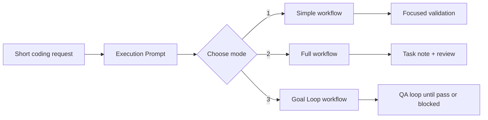

# simplepowers

[](https://github.com/youngchangjo/simplepowers-codex-skill)
[](#install)
[](https://github.com/youngchangjo/simplepowers-codex-skill)

**Turn short coding requests into confirmed execution prompts, then run the right workflow without loading every instruction at once.**

```text
short request -> Execution Prompt -> 1 / 2 / 3 -> selected reference only -> validated work
```

`simplepowers` is a lightweight Codex Skill for coding tasks where you want a little more discipline than "just start editing", but not a giant process framework.

## Quick Start

Install globally from public GitHub:

```bash
npx -y git+https://github.com/youngchangjo/simplepowers-codex-skill.git
```

Then use it in Codex:

```text
$simplepowers 로그인 실패 메시지를 원인별로 분리해줘. 테스트도 추가하고 안전하면 커밋해줘.
```

Codex will first produce an Execution Prompt, ask you to choose a mode, and then load only the selected workflow reference.

## Why

Short coding prompts are fast, but they often leave too much implicit:

- What exactly counts as done?
- Which files should stay untouched?
- Which tests or QA steps prove the change?
- Will the work produce a commit?
- Should this be a quick fix or a full acceptance loop?

`simplepowers` makes those decisions explicit before implementation starts.

## How It Works



The main `SKILL.md` stays small. Mode-specific instructions live in:

```text
.agents/skills/simplepowers/
  SKILL.md
  agents/openai.yaml
  references/
    simple.md
    full.md
    goal-loop.md
```

After you choose `1`, `2`, or `3`, Codex is instructed to read only the matching reference.

## Modes

| Mode | Best for | Task note | Commit | Review / QA |
| --- | --- | --- | --- | --- |
| `1` Simple | Focused bug fixes, small features, local refactors | Optional | Mandatory when files change | Focused validation + self-review |
| `2` Full | Broad, risky, security-sensitive, migration, API, or multi-file work | Mandatory | Mandatory when files change | Slice validation + review |
| `3` Goal Loop | UI/user-flow/acceptance work that must match the original spec | Mandatory | Mandatory after acceptance passes | Validation + QA loop until pass or blocked |

simplepowers is a commit-producing workflow. Confirming the Execution Prompt, choosing `1`, `2`, or `3`, or using direct execution authorizes a commit for relevant task changes.

If a safe commit cannot be created, the workflow should stop as `blocked` and report the exact blocker instead of silently skipping the commit.

## Install

### Global Install

```bash
npx -y git+https://github.com/youngchangjo/simplepowers-codex-skill.git
```

Default target:

```text
${CODEX_HOME:-~/.codex}/skills/simplepowers
```

Replace an existing install:

```bash
npx -y git+https://github.com/youngchangjo/simplepowers-codex-skill.git --force
```

GitHub package shorthand also works:

```bash
npx -y github:youngchangjo/simplepowers-codex-skill
```

### Project-Local Install

```bash
npx -y git+https://github.com/youngchangjo/simplepowers-codex-skill.git --project /path/to/your-project --force
```

Installs to:

```text
/path/to/your-project/.agents/skills/simplepowers
```

### Custom Target

```bash
npx -y git+https://github.com/youngchangjo/simplepowers-codex-skill.git --target /path/to/skills/simplepowers --force
```

### Clone and Install

```bash
git clone https://github.com/youngchangjo/simplepowers-codex-skill.git
cd simplepowers-codex-skill
npm install -g .
simplepowers-install --force
```

This package is installed from GitHub. It is not published to the npm registry yet, so this command is not expected to work:

```bash
npx simplepowers-codex-skill
```

## Usage

### Normal Flow

```text
$simplepowers 견적 계산에서 배터리 용량 단위 변환 버그를 고쳐줘. 기존 API 호환성은 유지해줘.
```

Expected flow:

```text
1. Simple workflow
2. Full workflow
3. Goal Loop workflow
```

### Prompt Only

```text
$simplepowers 프롬프트만: 결제 실패 케이스를 정리하고 테스트 추가하는 작업 프롬프트 만들어줘.
```

This produces the Execution Prompt only and does not edit files.

### Direct Execution

```text
$simplepowers use mode 1 and execute: 작은 오타 수정하고 테스트 확인해줘.
```

```text
$simplepowers use mode 2 and execute: 인증 리팩터링을 슬라이스별로 검증하면서 진행해줘.
```

```text
$simplepowers use mode 3 and execute: 새 견적 플로우가 처음 사양대로 동작할 때까지 구현, QA, 개선을 반복해줘.
```

## Safety Rules

`simplepowers` is intentionally conservative:

- no edits before prompt confirmation unless direct execution is requested
- no production dependencies without approval
- no unrelated refactors
- no unrelated user changes staged
- mandatory commit for relevant task changes in Git repositories
- blocked result instead of silent commit skip when commit safety cannot be proven
- skipped validation must be reported with a reason

## Commands

```bash
simplepowers-install --help
```

```text
--global              Install to ${CODEX_HOME:-~/.codex}/skills/simplepowers
--project <path>      Install to <path>/.agents/skills/simplepowers
--target <path>       Install to an exact target directory
--force               Replace an existing target directory
--dry-run             Print what would be installed
```

## Development

Validate the installer:

```bash
npm run validate
```

Preview npm package contents:

```bash
npm run pack:dry
```

## License

No open-source license has been selected yet. The repository is public for installation and inspection, but reuse rights are not granted beyond what GitHub access permits.
